# 💧 Solvent

**Should you pay now, pay in installments, or wait?**
Solvent is a deterministic financial affordability engine built for the HackerRank Orchestrate *"Buy or Wait?"* challenge. For every request a user makes — *"Can I afford this laptop?"* — it reconstructs their real financial state, simulates their cash flow 90 days into the future, and returns a safe, explainable recommendation.

No LLM calls at inference time. No guessing. Every number is traceable back to a rule.

---

## 🧭 What it actually does

Given a request like:

> *"I've been asked to transfer IDR 15,656,000 to my family. I need to complete it by 7 October 2025. Should I send the full amount, send part of it, or wait?"*

Solvent answers with **all** of the following, not just a yes/no:

| Field | Meaning |
|---|---|
| `amount_safe_to_pay` | The most the user can pay **today** without breaking their minimum balance |
| `affordability_status` | `affordable_now` / `affordable_with_plan` / `affordable_later` / `not_affordable` |
| `recommended_payment_method` | `full_payment` / `partial_payment` / `installments` / `wait` / `not_recommended` |
| `payment_plan` | Exact dates and amounts of every recommended payment |
| `earliest_date_for_full_payment` | The soonest date the full amount becomes safe |
| `spending_changes_needed` | Flexible expenses to stop/reduce, if any |
| `decision_explanation` | A short, human-readable reason for the call |

Two users with identical balances can get **different answers** — the engine factors in each user's minimum balance, recurring commitments, payment preferences, and willingness to cut flexible spending.

---

## 📥 What goes in

| Source | Feeds into |
|---|---|
| `requests.csv` | The actual question — amount, deadline, request type |
| `financial_profiles.csv` | Balance, currency, minimum balance, payment preferences, flexible spend categories |
| `financial_events.csv` | Every transaction — settled, pending, recurring, cancelled, linked lifecycles |
| `exchange_rates.csv` | Dated FX rates for multi-currency accounts (IDR, ZAR, INR, USD, EUR) |
| `request_payment_options.csv` | Real installment plans available for this specific request |
| `messages.csv` | Free-text corrections — *"salary increased to X"*, *"payment cancelled"*, *"delayed to Y"* |
| `images.csv` | Receipts/statements that back a blank-amount transaction |

Messages and images are treated as **untrusted data** — they can amend facts, but they can never override the safety rules.

---

## 🏗️ Architecture

```mermaid
flowchart TD
    A[📄 requests.csv] --> B[data_loader.py]
    B --> C[events.py<br/>build cash-flow timeline]

    subgraph reconstruct["🔎 Reconstruct financial truth"]
        C --> C1[Apply image amounts<br/>for blank-amount events]
        C1 --> C2[Parse message amendments<br/>cancel / delay / amount change]
        C2 --> C3[Collapse linked lifecycles<br/>settled beats estimate]
        C3 --> C4[Drop non-cash / pending-credit /<br/>variable income]
        C4 --> C5[Convert to home currency<br/>via currency.py]
        C5 --> C6[Tag recurring events<br/>+ inferred cadence]
    end

    C6 --> D[forecast.py]

    subgraph simulate["📈 Simulate 90+ days forward"]
        D --> D1[precompute_events<br/>project recurring income & bills]
        D1 --> D2[simulate_balance<br/>walk the calendar day-by-day]
        D2 --> D3[find earliest safe date<br/>+ max safe amount today]
    end

    D3 --> E[decision.py]

    subgraph decide["⚖️ Decide the safest plan"]
        E --> E1[Enumerate options user accepts:<br/>full / partial / installments / wait]
        E1 --> E2{Any option safe<br/>with zero changes?}
        E2 -- no --> E3[Search stop/reduce<br/>combinations, fewest first]
        E2 -- yes --> E4
        E3 --> E4[Rank by spec tie-break:<br/>deadline → no changes → cost →<br/>start date → fewer payments → id]
    end

    E4 --> F[explain.py<br/>generate short explanation]
    F --> G[📊 output.csv]

    style A fill:#e0f2fe,stroke:#0284c7
    style G fill:#dcfce7,stroke:#16a34a
    style reconstruct fill:#fef9c3,stroke:#ca8a04
    style simulate fill:#fce7f3,stroke:#db2777
    style decide fill:#ede9fe,stroke:#7c3aed
```



### Module map

```
code/
├── main.py            🚀 entry point — runs every request, writes output.csv
├── data_loader.py      📦 CSV loading + type coercion
├── events.py           🔎 per-user cash-flow timeline: images, messages,
│                          lifecycle collapsing, recurring-cadence detection
├── forecast.py         📈 day-by-day balance simulation, recurring-event
│                          projection, earliest-safe-date search
├── currency.py         💱 fixed-date exchange-rate conversion
├── decision.py         ⚖️  enumerates payment options, applies the 90-day
│                          safety rule, ranks by the spec's tie-break order
├── explain.py           💬 turns the chosen option into plain English
└── tests/               ✅ validates against known-correct sample answers
```

---

## 🔬 How the "agent" actually reasons

There's no single model call doing the thinking — the reasoning is decomposed into deterministic stages, each auditable on its own:

1. **Perceive** — read every record touching this user: transactions, messages, images, preferences.
2. **Reconcile** — when sources conflict, prefer (in order) an explicit cancellation/amendment → a newer record → a settled event over a forecast → the financially safer read.
3. **Forecast** — project recurring income and bills forward, day by day, for 90+ days. An amount-aware anchor makes sure a one-off bonus or a bad month doesn't get mistaken for the real recurring value.
4. **Search** — enumerate every payment method the user is willing to consider; only reach for spending cuts (stop/reduce flexible expenses) when no plan is safe without them.
5. **Rank** — apply the spec's exact tie-break order so the *safest, cheapest, soonest* plan always wins ties.
6. **Explain** — say why, in one sentence.

---

## ⚙️ Running it

```bash
cd code
pip install -r requirements.txt
python main.py                # regenerates dataset/output.csv
```

Validate against the 25 known-correct sample requests:

```bash
cd code/tests
python test_sample_requests.py
```

Run the demo frontend (visualizes sample requests + recommendations):

```bash
cd frontend
npm install && npm run dev
```

---

## 🖥️ Frontend

A small React + Vite + Tailwind UI that renders the sample requests and their computed recommendations — monospace figures, strict grids, an interactive cash-flow evidence dropdown. It's a viewer for the engine's output, not a live backend integration.

---

## 📁 Repository layout

```
.
├── code/                        ← the submittable engine (see code/README.md)
├── dataset/                     ← challenge inputs + generated output.csv
├── frontend/                    ← React demo UI
├── chat_transcript.jsonl        ← original build session
├── chat_transcript_session2.*   ← debugging & hardening session
└── problem_statement.md         ← the original challenge brief
```

---

## 🧠 Why deterministic, not an LLM call per request

Reproducibility, auditability, and cost — every recommendation traces back to a specific rule instead of a model's judgment call, and the same input always produces the same output. See [`code/evaluation/usage_report.md`](code/evaluation/usage_report.md) for the full token/cost accounting (spoiler: zero model calls at runtime).

---

## 📜 License

MIT
